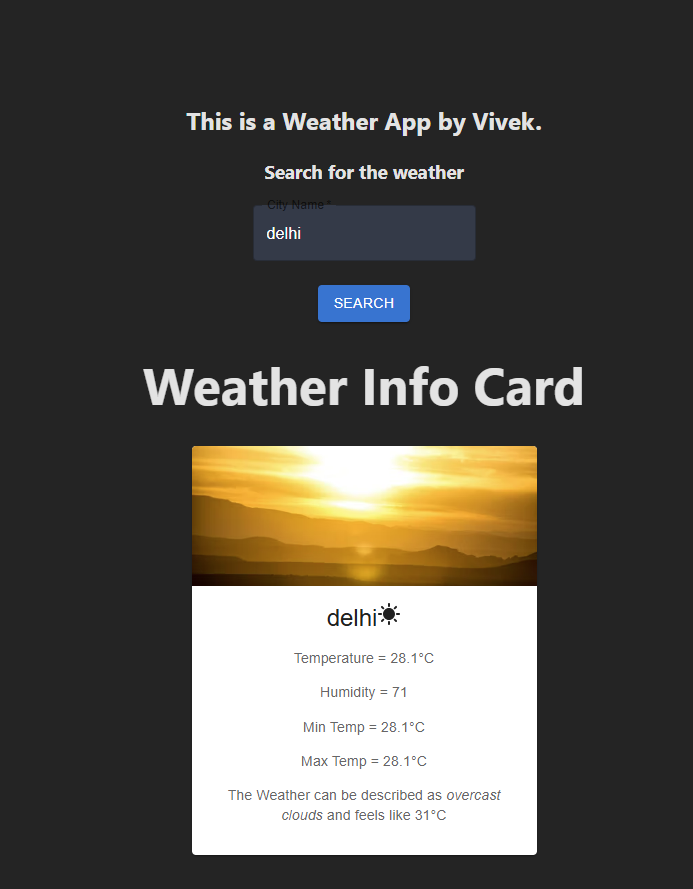

# 🌦 Weather App by Vivek

A simple and interactive weather application built with **React**, **Material UI**, and the **OpenWeather API**.  
The app allows users to search for weather information of any city and displays it instantly in a beautifully designed weather card with an image that updates dynamically based on the temperature.

---

## 📸 Project Screenshot


---

## ✨ Features
- 🔍 **Search weather by city**  
- 🌡 **Displays temperature, humidity, min & max temperature**  
- ☀ **Dynamic weather card image updates based on temperature**  
- ❌ **Handles errors when city does not exist**  
- ⏱ **Instant data fetch and display**  
- 🎨 **Clean UI with Material UI styling**  

---

## 🛠 Tech Stack
- **React.js**
- **Material UI (MUI)**
- **Bootstrap (for additional styling)**
- **OpenWeather API**

---

## 📂 Project Structure
```
src/
│
├── components/
│ ├── SearchBox.jsx # Search bar for entering city name
│ ├── InfoBox.jsx # Displays weather information
│ ├── WeatherApp.jsx # Main component handling logic & state
│
├── App.js # Main App entry
├── index.js # React DOM rendering
└── App.css # Styling
```

---

## ⚙️ How It Works
1. User enters a **city name** in the search box.
2. The app fetches weather data from **OpenWeather API**.
3. If the city exists, it updates the **Weather Card** with:
   - Temperature (°C)
   - Humidity (%)
   - Min & Max Temperature
   - Weather description
4. **Background image of the card** changes based on temperature:
   - Hot → Sunny image
   - Cold → Snowy image
   - Moderate → Cloudy image
5. If the city is invalid, an **error message** is displayed.

---

## 🔑 API Reference
**OpenWeather API** – [https://openweathermap.org/api](https://openweathermap.org/api)  
- Endpoint used: `/data/2.5/weather`
- Units: Metric (°C)

Example API call:
https://api.openweathermap.org/data/2.5/weather?q={city}&appid={API_KEY}&units=metric


---

## 🚀 Installation & Setup
```bash
# Clone the repository:
   git clone https://github.com/yourusername/weather-app.git
   cd weather-app

# Install Dependencies:
    npm install

# Get your OpenWeather API key from:
    https://openweathermap.org/appid

#  Create a .env file in the project root and add:
    REACT_APP_OPENWEATHER_API_KEY=your_api_key_here

# Start the development server:
    npm start

    
```

